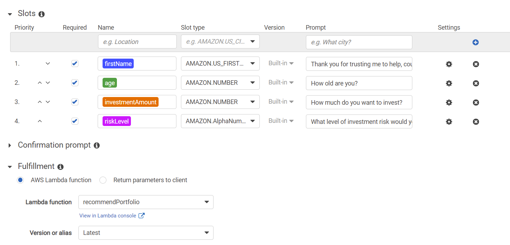

# RobotAdvisor

The Robot Advisor provides investment advice based on user's risk level tolerance.  The chat robot is programmed with Amazon AWS LEX and LAMBDA.  

## Initial Chat Robot without Lambda

Please see below Robot Chat clip.

https://user-images.githubusercontent.com/95498383/162590010-a480ebed-4f70-40dc-b10b-ea6ee16f8bad.mp4

## Chat Robot with Lambda

Please see below Robot Chat clip.

https://user-images.githubusercontent.com/95498383/162590011-72dfe263-1a6e-41ba-88ba-fafffcbee4fc.mp4

## AWS Lambda with Python

lambda_function_final.py includes the python code for AWS Lambda

## AWS LEX Configuration

Please see below AWS LEX configuration of Robot Advisor.

