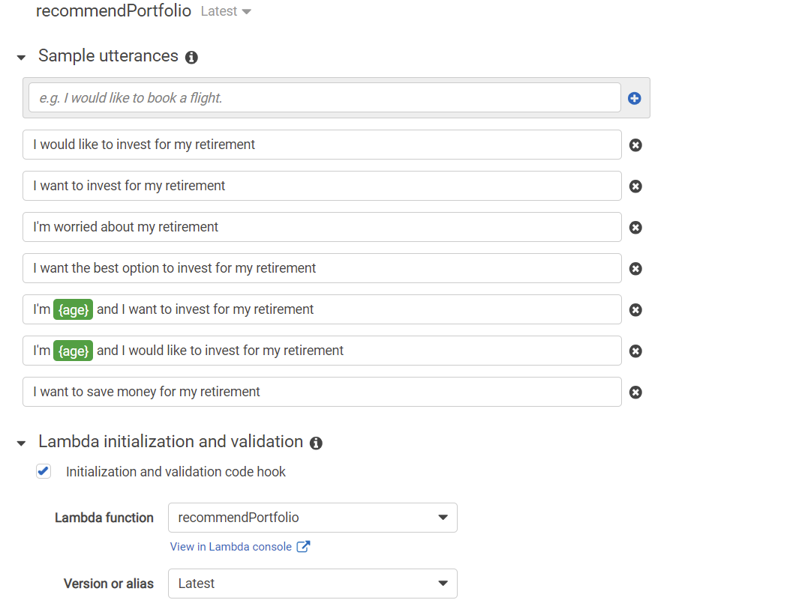

# RobotAdvisor

The Robot Advisor provides investment advice based on user's risk level tolerance.  The chat robot is programmed with Amazon AWS LEX and LAMBDA.  

## Initial Chat Robot without Lambda

Please see below Robot Chat clip.

## Chat Robot with Lambda

Please see below Robot Chat clip.

## AWS Lambda with Python

lambda_function_final.py includes the python code for AWS Lambda

## AWS LEX Configuration

Please see below AWS LEX configuration of Robot Advisor.

